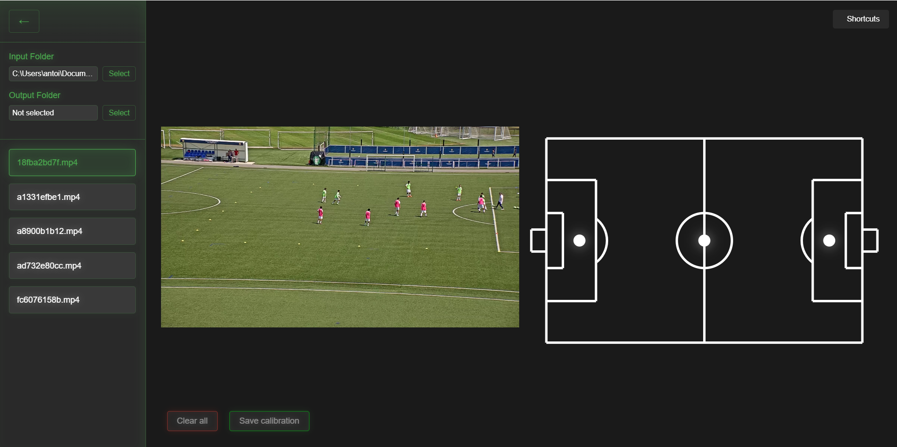

# Polylines Labeling Tool - Vue-Electron Application

This desktop application is built with Vue.js and Electron, providing a modern and responsive user interface.

## 🖼 Interface Preview



## 🚀 Prerequisites

Before you begin, ensure you have the following installed on your system:
- [Node.js](https://nodejs.org/) (version 12 or higher)
- [npm](https://www.npmjs.com/) (usually comes with Node.js)

## 🛠 Installation

1. Clone the repository:
```bash
gh repo clone 2nzi/vue-electron
cd vue-electron
```

2. Install dependencies:
```bash
npm install
```

## 💻 Development

To run the application in development mode with hot-reload:
```bash
npm run electron:serve
```

This will start both the Vue.js development server and the Electron application.

## 📦 Building for Production

To create a production build:
```bash
npm run electron:build
```

This will create a distributable package in the `dist_electron` folder.

## 🔧 Available Scripts

- `npm run electron:serve` - Run the application in development mode
- `npm run electron:build` - Build the application for production
- `npm run serve` - Run the Vue.js development server only
- `npm run build` - Build the Vue.js application
- `npm run lint` - Lint and fix files

## 📝 Project Structure

```
vue-electron/
├── src/              # Source files
├── public/           # Public static files
├── dist_electron/    # Production build output
└── node_modules/     # Dependencies
```

## 🔨 Technologies Used

- Vue.js 3
- Electron
- Vue Router
- js-yaml

## 📄 License

[Your License Here]

## 👥 Contributing

1. Fork the project
2. Create your feature branch (`git checkout -b feature/AmazingFeature`)
3. Commit your changes (`git commit -m 'Add some AmazingFeature'`)
4. Push to the branch (`git push origin feature/AmazingFeature`)
5. Open a Pull Request

---
For more information about Vue.js configuration, see the [Vue CLI Configuration Reference](https://cli.vuejs.org/config/).
For Electron documentation, visit [electronjs.org](https://www.electronjs.org/).
